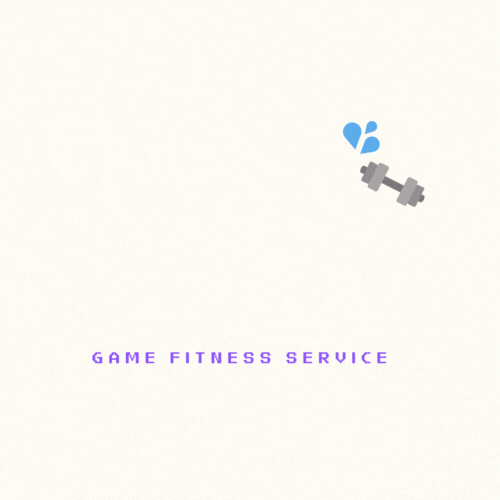
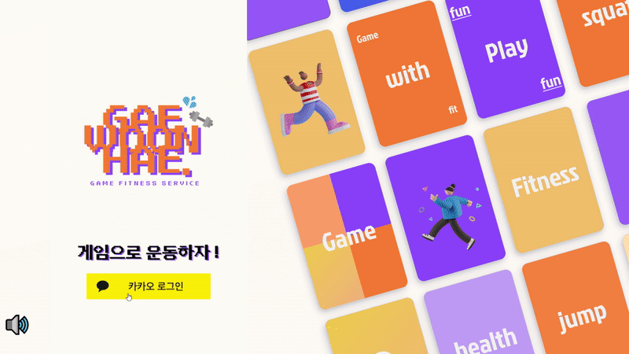
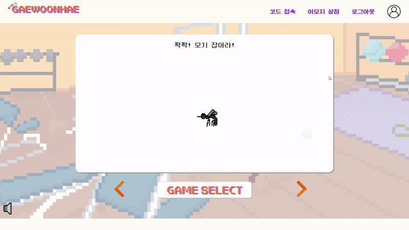
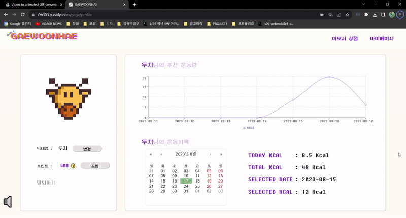
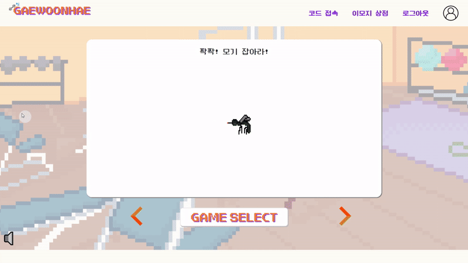
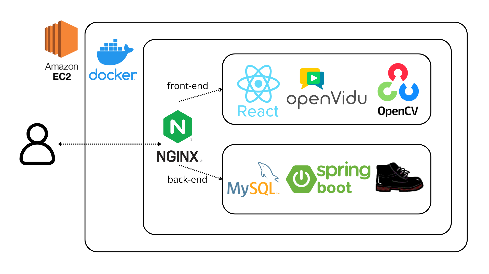
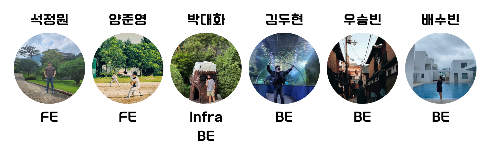

# 🎮+ 🤸‍♀️ = 개운해(Web-RTC 기반 바디 레크리에이션 플랫폼)

## 🌟 서비스 개요
<center>
[  ](https://youtube/Wdtb7Ek3Li4)

(로고를 클릭하면 소개 UCC로 이동합니다.)

***놀면서 운동하는 가면 놀이터***

- 게임으로 운동해, 개운해는 운동에 진입장벽을 느끼는 현대인들에게 재밌고 뿌듯한 액티비티를 제공하고자 합니다.
## 💡 주요 특징


- WebRTC 기반 비디오 공유 서비스
- WebSocket을 이용한 실시간 게임 정보 통신, 채팅
- OpenCV를 이용한 얼굴 이모지 처리
- Teachable machine을 이용한 자세 판별
- 활동기록 조회 및 보상 시스템

## 🖥️ 서비스 화면


- 로그인



- 이모지상점



- 마이페이지



- 대기방 생성



- 게임방 입장

- 게임 진행

- 결과페이지

## 🏘️시스템 아키텍쳐



## 📡 기술 스택

### 1. STOMP 웹 소켓 프로토콜

STOMP(Simple/Stream Text Oriented Message Protocol)란, 클라이언트와 서버 간 통신과 클라이언트 간의 서버를 경유한 상호 통신이 가능하도록 websocket 위에서 동작하는 문자 기반 메시징 프로토콜입니다.

게운해 프로젝트에서는 다음 네 가지의 실시간 기능을 구현하기 위하여 웹 소켓이 필요했습니다.

- 대기방 접속 인원의 변화를 감지하고 이를 모든 사용자에게 전달하여 클라이언트의 상태 갱신
- 대기방 내의 실시간 채팅 기능 구현
- 게임 시작, 종료 제어 신호의 동시 전송
- 게임 진행 중 유저 간의 포인트 변화와 순위 변화 상황 실시간 통신

저희는 문자열 기반의 간단한 데이터 통신이 대부분 이라는 점과, 잦은 브로드캐스팅 통신 사용을 고려하여, 발행 - 구독 형식으로 간단하게 채널을 등록하고 텍스트 기반으로 웹 소켓 통신을 할 수 있는 STOMP를 웹 소켓 프로토콜로 채택하였습니다.

### 2. OpenCV.js 이미지 처리

OpenCV(Open Source Computer Vision)는 최근 영상 처리에서 가장 많이 쓰이고 있는 오픈소스 라이브러리 입니다. C 에서 시작하여 현재는 C++, Python, Java, Javascript 등 많은 언어에서 활용되고 있으며 이미지 보정, 영상 합성, 기계 학습 용 특징 추출 등 이미지, 영상과 관련된 분야에서 다양하게 사용되고 있습니다.

게운해 프로젝트에서는 웹캠을 사용하여 게임을 진행하는 특성상 사용자의 얼굴이 노출됩니다. 이에 사용자의 익명성을 보호하기 위하여 웹캠 화면으로부터 얼굴을 인식하고, 그 위에 여러 이모지를 합성하여 얼굴을 가릴 수 있도록 하는 이모지 시스템을 사용하며, 이를 구현하기 위하여 영상 합성 기능을 사용할 수 있는 Javascript 라이브러리인 OpenCV.js 를 사용하였습니다.

### 3. Teachable Machine 모션 캡쳐

Teachable Machine은 구글에서 개발한 웹 기반 인공지능 학습 사이트 입니다. 이미지, 음성, 포즈 등에 대해 미리 학습된 머신러닝 모델의 마지막 일부 레이어만을 사용자의 입력 데이터로 다시 학습시키는 전이 학습을 이용하여 분류 모델을 생성합니다. Teachable Machine의 장점은 사용자가 코드를 작성하지 않아도 웹 페이지에서 간편하게 데이터를 입력하여 분류 모델을 만들 수 있다는 점 입니다.

게운해 프로젝트에서 모션 인식은 게임 진행의 핵심 모델입니다. 사용자의 자세를 카메라로 인식하여 올바른 자세인지 판단하고, 이를 통해 사용자는 포인트와 운동 기록을 저장할 수 있습니다. 이를 구현하기 위해서 여러 모션 인식 인공지능 모델을 고려하였고, 그 중 Javascript에서 특별한 모델 생성 없이 링크로 모델을 바로 가져와 사용할 수 있는 Teachable Machine을 사용하였습니다.


## 🛠️ 개발 환경


- BackEnd
```
    Intelliji
    Java 11
    Spring boot 2.7.1
    Gradle
    JPA hibernate
    Spring Security
    Stomp-websocket 2.3.3
    Mysql
    
```
    

- FrontEnd
    
```
    Visual Studio Code
    Bootstrap 5.3.1
    redux-toolkit 1.1.2
    styled-component 2.8.0
    SockJS 1.6.1
```
    
- CI/CD
    
```
    AWS ec2
    Nginx
    Docker 24.0.04
    
```
    
- Convergence Technology
    
```
    ⚙ Teachable Machine 0.8.3
    OpenVIdu 2.28.0
    OpenCV 4.8.0
    
```

## 🤝 팀소개


## 📋 산출물
- 기능정의서
- ERD
- 시스템 다이어그램
- API 명세서

## 📋 팀스페이스

상세 개발과정 및 후일담은 아래에 정리되어있습니다!

🚀[개운해 팀스페이스](https://www.notion.so/e803aff4b5e941beaae98885e5b8dbc4?pvs=21)🚀
